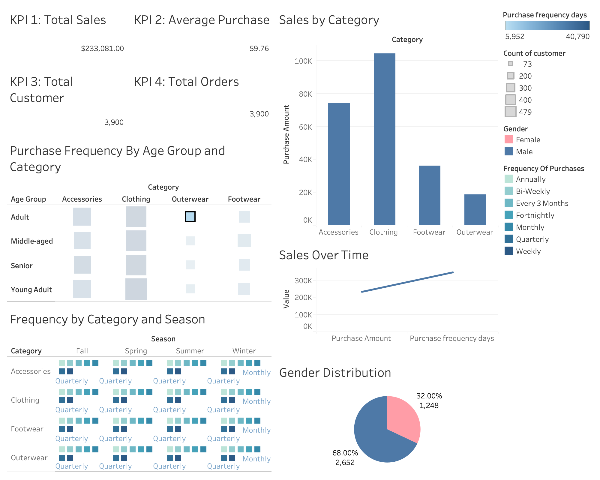

# customer_behavior_analysis
## Data Analysis & Visualization Project

## Overview
This project demonstrates an **end-to-end data analytics workflow** completed by following a guided YouTube tutorial.  
The objective of the project is to analyze a dataset, extract meaningful insights, and present them through an interactive dashboard.

The project was completed on **macOS** and covers the full analytics lifecycle:
- Data loading and analysis using Python
- Exploratory Data Analysis (EDA) and data cleaning
- SQL querying using PostgreSQL
- Data visualization using Tableau

## Dataset
- The dataset was loaded and processed using Python.
- Data was explored, cleaned, and prepared for analysis.
- Cleaned data was stored and queried in a PostgreSQL database.

---

## Tools & Technologies
- **Operating System:** macOS  
- **Programming Language:** Python  
- **Analysis Environment:** Jupyter Notebook  
- **Database:** PostgreSQL  
- **Database Tool:** pgAdmin 4  
- **Visualization Tool:** Tableau  
- **Version Control:** Git & GitHub  

---

## Project Steps
1. Loaded the dataset into **Python** using Pandas
2. Performed **Exploratory Data Analysis (EDA)**
3. Cleaned and prepared the data for analysis
4. Stored data and executed **SQL queries** on a PostgreSQL server
5. Extracted insights using SQL and Python
6. Built an **interactive Tableau dashboard** to visualize findings

---

## Dashboard
The Tableau dashboard highlights:
- Key metrics and trends
- Comparisons across categories
- Insights derived from the analysis
---

## Results
- Identified key trends and patterns in the data
- Improved data quality through cleaning and preprocessing
- Transformed raw data into actionable insights
- Presented results in a clear and visually engaging dashboard

---

## How to Run the Project

1. Clone this repository:
   git clone https://github.com/imxal/customer_behavior_analysis.git

2. Open and run the Jupyter Notebook:
   notebooks/customer_behavior_analysis.ipynb

3. Open Tableau dashboard:
   tableau_dashboards/Dashboard.twbx

## Dashboard

Below is a preview of the Tableau dashboard created as part of this project:

   

